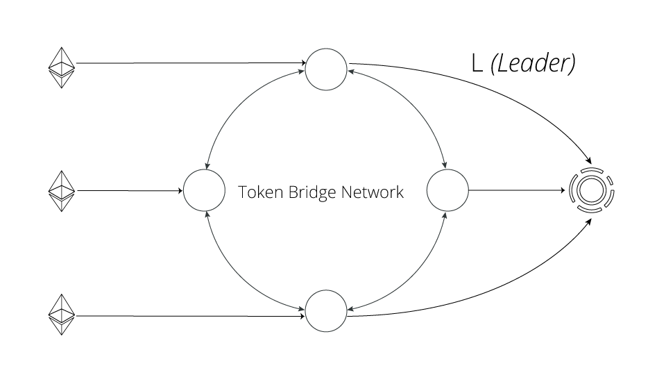
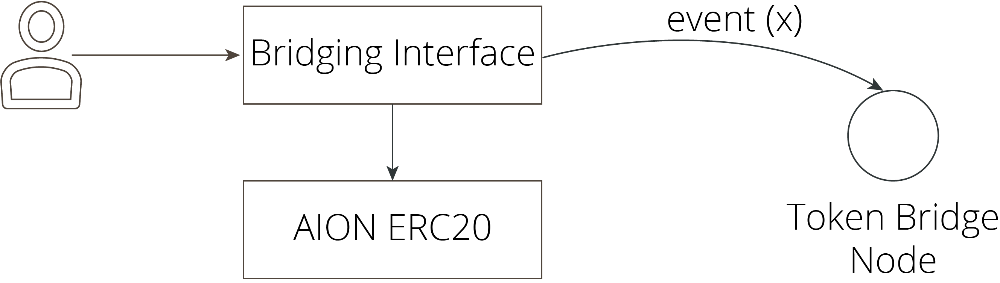

# Aion Token Bridge

The Aion Token Bridge is a proposed trusted distributed network responsible for forwarding transfer requests from the AION ERC20 Token into Aion Coins. The detailed structure and underlying network are still under development as of this writing. Documentation for these components will be published as it becomes available. The source code in this repository will precede the documentation. Feel free to examine our tests folder to get an idea of the current implementation. This document, however, will not cover the technical details. Here we cover the network from the perspective of the end-user, namely the AION ERC20 token holder.

## A Bird's Eye View

From a high-level (think stratospheric) perspective, the network is composed of a quorum of nodes, each with a _local_ perspective of both the Ethereum and AION network. The network's purpose is to facilitate ERC20 transfer ``requests`` from Ethereum to the Aion network.

This bridging network does not represent the generic bridging network that AION will support. Instead this specialized network is only intended to transact AION ERC20 tokens from Ethereum to the Aion network, this network and some underlying architecture (such as the interface to Ethereum) will serve as reusable components for future Aion bridges to Ethereum.

Because of the probabilistic nature of both networks, the bridging network will employ both standard techniques (confirmations) and achieve consensus through consensus protocols implemented atop both networks to ensure the network is resilient to any faults or divergences that occurs among the bridging nodes. In addition to this, the network should be self-repairing assisting in the re-synchronization of nodes that have diverged from the main branch in either network. For the situations when the network does shutdown, mechanisms are set in place to reboot the network to the latest consistent state. After a reboot the bridge network returns to transferring tokens from that point in time.

## Interacting with the Bridge using Smart Contracts

To begin, the user must have access to:

1) an Ethereum account with AION Tokens, and
2) an Aion account

The process of generating an Aion account is covered in the wiki documentation of the Aion GitHub project [1]. The following is one possible avenue of interacting with the bridge directly through smart contracts.

From the user's perspective, this process is designed to be as seamless as possible, requiring a minimal number of actions from the user. To make a transfer, the user need only interact on Ethereum with the Aion ERC20 Token Contract, and a new contract that we're referring to as the ``Bridging Interface``.

As indicated by the diagram above, the ``Bridging Interface`` sits atop our Aion ERC20 Token. Essentially the user will first allocate a portion of their funds for transfer, this is done through a standard ERC20 call:

~~~~
approve(address _spender, uint256 _value);
~~~~

In our scenario, the ``_spender`` address that is allocated the allowance is the ``Bridging Interface`` contract, essentially the interface to the bridging network. The user should insert ``<bridging interface address>``, an address we will be providing when the bridge is production ready to approve an amount (``_value``) to be consumed by the bridging network.

Once this is done, we can simply place a call to the ``Bridging Interface`` contract:

~~~~
bridgeTransfer(bytes32 _to, uint256 amount);
~~~~

In this function call, the ``_to`` represents the Aion account intended to receive the token amount (recall that Aion addresses are 32 bytes). The amount should be a value equivalent to, or less than the amount that the user approved the bridging contract to spend. It is critical here that the user not make a mistake on either the intended recipient address or the amount to be transferred. 

This triggers two things:

1) It moves the allowed balance into the ``Bridging Interface`` contract, thus effectively ``burning`` the tokens. This means the tokens are out of circulation forever.

2) It emits an ``event`` recording the occurance of the event on the blockchain. The confirmation of this event is processed by the ``Bridging Network`` to move tokens onto Aion.

This function essentially indicates to the contract (and subsequently the token bridge) the user's Aion address.

After this step, the user need only observe transactions passing through the bridge and on the Aion network (for both of which we will provide front-ends) to verify that the tokens have been properly allocated. Experienced users will opt to interact with the blockchain directly by syncing up a Aion node.

# Resources

[1] https://github.com/aionnetwork/aion/wiki/Command-Line-Interface